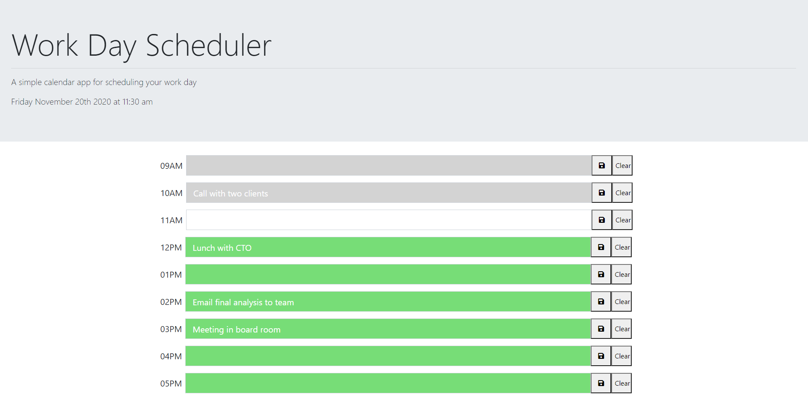

# Work-Day-Scheduler

This project is an online schedule which can be utilized for note taking, keeping track of relevant meeting times, etc. The input fields will change color based on the time of day; if the hour has already passed it will be grey, if it is present the input field will be white, and if the hour is in the future the input field will be green. 

Notes can be entered into the input fields and saved with the save button and cleared with the clear button; if the user refreshes the page, their notes will still be stored in the input field.

https://rsg71.github.io/Work-Scheduler/

